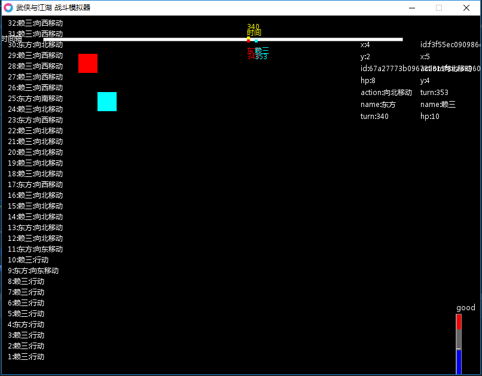

# 《武侠与江湖战斗模拟器》

***

## 主要目标
- [ ] 基本的动作，靠近、远离、攻击、防御
- [ ] 基本的逻辑判断，依据血量与距离，选择动作
- [ ] 复杂的行为，如非战斗状态，依据时间吃饭、巡逻、聊天、转入战斗状态
- [ ] 各种状态的实现，如晕倒、流血、封穴、冰封、灼烧、中毒、饥饿、口渴、困乏等等
- [ ] 各种技能的实现，技能伤害、范围、距离、特效、附加状态

***

## 部分属性

| 技能名称      | 类别          |伤害范围       | 伤害距离      |基础伤害|
| ------------- |:-------------:|:-------------:|:-------------:|-------:|
| 罗汉拳        | 拳法          |  点D1         | 1             |   1D3  |
| 华山剑法      | 剑法          |  线D2         | 2             |   1D4  |
| 太祖枪法      | 枪法          |  线D3         | 3             |   1D5  |
| 降龙十八掌    | 掌法          |  柱D5         | 1             |   8D5  |

1. 基本规则，借鉴DND r3的规则，因此打出 9999 等的伤害，应该是不会出现的。人物的生命，也会尽可能控制在 1000 以内。
2. 战斗流程，借鉴CDDA，采用半即时制，根据人物采取的行动，消耗的时间不同，因此会有先后顺序的差别。
   例如：降龙十八掌，威力巨大，但需要调息的时间也较长，对方可以选择逃跑。当然一般人不会知道你下一步将用 降龙十八掌
3. 目前的难点是，如何让技能的提升有比较直观的表现，如范围改变、伤害提升等，还想不到好办法
4. 各种状态的时间，效果 如何设计。

***

## 目前效果

***
## 关于行为树 Behavior3

战斗模拟器，用的主体Behavior3是从 Behavior3lua 这个仓库中获得的，自己做了些修正。

- Behavior3lua 是 Behavior3 Editor的lua接口版本实现。

- Behavior3 Editor是基于web的behavior tree设计工具，可以导出为json格式，

- 官网里面只提供了python和js版本的接口，所以大神实现了一套lua版本的接口。我自己修改了部分

大神的仓库地址

*   [GitHub：]https://github.com/nottvlike/behavior3lua

相比官方接口，还未更改的部分：
*   behavior tree的dump接口未实现

参考:
*   Info: http://behavior3.com
*   Editor: http://editor.behavior3.com
*   github: https://github.com/behavior3/behavior3editor
